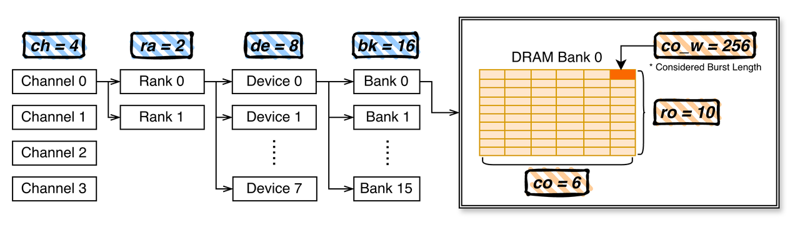
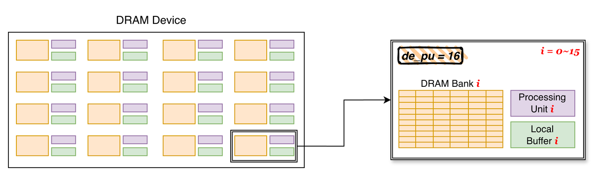
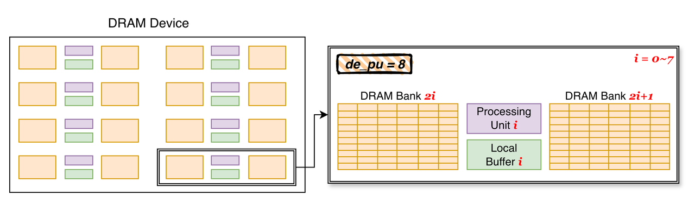
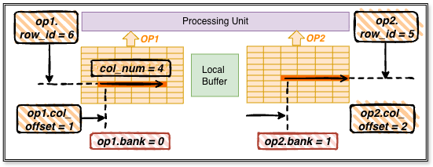
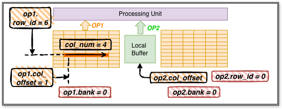
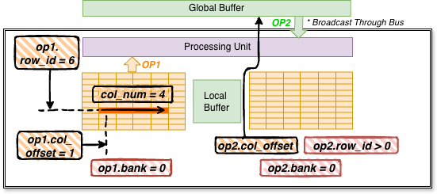

# 0. Setup

<!-- ## Download the repo -->

```bash
# download the repo
git clone git@github.com:UniNDP-hpca25-ae/UniNDP.git
# enter the repo
cd UniNDP
# install requirements
pip install -r requirements.txt
```

<!-- ## Requirements

- OS: Linux Ubuntu.
- Python, PyYAML, numpy, tqdm, csv. -->


<!-- ## Download the results

> Some of the compilation process is time-comsuming, if you want to skip part of the workload compilation process, you can download the results from the following link.

```bash

``` -->

# 1. How to start

> You can skip this section if you are not interested in the detailed usage of the compiler.

## 1.1 Compiler Usage

### Compile a single operator

```bash
python compile.py -A {architecture_name} -W {workload_type} -S {input_size, reduce_size, output_size, batch_size} -O {output_dir}
```

You can use `-h` option to see the detailed usage of the compiler.

```bash
python compile.py -h
```

### Compile using bash script

#### Step 0: prepare the workload csv

Go to the `workload` dir, we have provided some workload files for you to compile. You can also create your own workload file following the format description in the `workload/README.md`.

#### Step 1: run the script

Choose the workload file and architecture configuration you want to compile, and run the following bash command.

```bash
cd UniNDP
./process_workload.sh {workload_file_name} {architecture_name} {workspace_name}
```
This bash command will compile the workloads on the specified architecture configuration, which will issue a bunch of `nohup xxx &` commands on the background. The output log will all be stored to `nohup.out` file.

#### Step 2: How to monitor and terminate the compile commands issued by the script ?

To monitor the issued compile commands, you can use commands like
```bash
watch 'ps -aux | grep compile'
```

To kill certain background process, you can use commands like
```bash
kill -9 $(ps -aux | grep compile | grep -v grep | awk '{print $2}')
```

#### Step 3: Export the results

After all the workloads are compiled, the result csv and log file will be stored in `./{workspace_name}/{workload_name}_{architecture_name}/csv` and `./{workspace_name}/{workload_name}_{architecture_name}/log` respectively. 

You can use `combine_op.sh` under `./workload` to automatically create results csv files under `./{workspace_name}`, see [2.1]() for more details.

Besides, you can also use `combine_e2e.sh` to directly export the end-to-end results into a single csv file, see [2.2]() for more details.

## 1.2 simulator usage

please refer to [`testsim.py`](testsim.py) and [simulator documentation](#2-simulator-documentation) for the usage of the simulator.

## 1.3 Adding a new architecture

- Directly modify the configuration file under `UniNDP/config` if you want to explore different architecture settings on existing computation dataflow. 
- To explore a new dataflow, you should copy `UniNDP/backend/_template.py` to add a new backend, which requires further efforts.

# 2. Simulator Documentation

## 2.1 Hardware Description

Parameters for the simulator are specified in [config](config) forder, and will be marked as `parameter` in the documentation.

### 2.1.1 Memory Hierarchy



To specify the memory hierarchy, the parameters includes:

- `ch`: number of DRAM channels
- `ra`: number of DRAM ranks per channel
- `de`: number of DRAM devices per rank
- `bg`: number of DRAM bank groups per device
- `ba`: number of DRAM banks per bank group

For the DRAM bank, the parameters includes:

- `ro`: number of DRAM rows
- `co`: number of DRAM column (also considering burst length) in a row
- `co_w`: size a DRAM burst access (bits)

Timing parameters such as `tCCDL` are also specified at the end of the config file.

### 2.1.2 NDP Components

#### Processing Units (PU) & Local Buffer (LB)

Take bank-level NDP as an example, the key parameter to add PU and LB is:

- `de_pu`: a list. Each element in the list stands for a possible number of activated PUs per DRAM device, and should be a divisor of `bk`.

Different activated PU numbers correspond to different connection modes of PUs and DRAM banks. Here are two possible computation mode for `de_pu=[8,16]` when `bk=16`.





In both mode, LBs are directly connected to each PU. When 16 PUs are activated, each PU are directly connected to its nearest DRAM bank, and when 8 PUs are activated, each PU are connected to 2 nearest DRAM banks. Selection between different modes are specified in the `pu` field of [computation instructions](#221-computation-instruction).

As shown in the diagrams, the zoom out part forms a "directly connected area", where direct data exchange (independent of data bus / host) can happen here.

- PU can directly access data from DRAM bank / local buffer, please refer to [computation instructions](#221-computation-instruction) for detailed ISA.
- Data can be directly moved between Local Buffer and DRAM Bank, please refer to [memory movement instructions]() for detailed ISA.

To specify details of PUs, the parameters includes:

- `data_pr`: data precision of PU computation
- `de_pu_w`: (m,n,k), which means a PU can compute MM of A(m,k) * B(k,n) within a DRAM access interval (`tCCDL`). Currently the we only support (m,n)=(1,1), which is a vector mutiplication.

To specify details of LBs, the parameters includes:

- `de_pu_bf`: size of the LB for input (bits)
- `de_pu_inbuf`: size of the LB for output (bits)
- `de_pu_bf_rl`: read latency of LB
- `de_pu_bf_wl`: write latency of LB

#### Global Buffer (GB)

In each device, we also allows the user to add a global SRAM buffer, which can be accessed by all PUs in the device through memory bus. 
To specify the global buffer, the parameters includes:

- `de_gb`: size of global buffer per device
- `de_gb_rl`: number of DRAM banks per PU
- `de_gb_wl`: number of DRAM banks per PU

During computation, input can also be broadcasted to all PUs from global buffer, please refer to [computation instructions](#221-computation-instruction) for detailed ISA.
Also, data movement can happen between global buffer and DRAM bank in the same device, please refer to [Memory Movement INST]() for detailed ISA.


### 2.1.3 NDP at Different Hireachy

Similar to the configuration of PU / LB / GB in each device, same components can be added to rank level using:
- `ra_pu`: number of PUs per rank
- `ra_pu_bf`: size of the LB (bits)
- `ra_pu_bf_rl`: read latency of LB
- `ra_pu_bf_wl`: write latency of LB
- `ra_gb`: size of global buffer per rank
- `ra_gb_rl`: read latency of global buffer
- `ra_gb_wl`: write latency of global buffer

You can refer to the configuartion file and backend kernel of `dimmining` architecture for example usage.

## 2.2 INST Definition

INST format are as follows, all fields are listed in a tuple, examples can be found in [`testsim.py`](testsim.py):

| Field        | Description                                                                      |
|--------------|----------------------------------------------------------------------------------|
| `LEVEL`      | Instruction hierarchy: SYS, CH, RA, DE, PU                                       |
| `OPTYPE`     | Operation type: host_read, pu, reg2buf, buf2reg, buf2bk, bk2buf, bk2gb, gb2bk    |
| Others...    | Each instruction level/type has their own fields|

### 2.2.1 Computation Instruction

Currently, we only consider the Mutiply-and-Accumulate (MAC) computation of two operands (OP1/2). The computation instruction format is as follows:

| Field        | Description                                                                      |
|--------------|----------------------------------------------------------------------------------|
|  `LEVEL`| = `LEVEL.DE` or `LEVEL.RA`|
| `OPTYPE`| = `OPTYPE.pu`|
| `ch_id`      | Channel ID (e.g., 0)|
| `ra_id`      | Rank ID (e.g., 0)|
| `de_id`      | Device ID (e.g., 0)|
| `pu` | `(num, mask)`: number of PUs activated, and a mask for detailing which PUs are actually used|
| `op1` | `(bank, row_id, col_offset)`, specify the address of operand 1,explain later|
| `op2` | `(bank, row_id, col_offset)`, specify the address of operand 2,explain later|
| `col_num` | computing data from `col_num` continous DRAM columns in the same row |
| `auto_precharge` | Whether to automatically precharge the bank after the instruction is executed|

`pu.num` should be one of the values in `de_pu`, which correspond to a certain connection mode.

For `bank` in op1 and op2, it indicates which bank does the pu fetch data from, as each PU maybe directly connected to more than one bank. But it should be noticed that `0 <= op1/2.bank < bk//pu.num`. 

Here're some examples of the computation procedure in a device (`LEVEL.DE`) when `bk=16, pu.num=8`.

#### Case 1: Computing using DRAM banks



As shown in the diagram, when `op1.bank != op2.bank`, OP1/2 are fetched from different DRAM banks, and multiplied by the PU. 
`Row_id` and `col_offset` indicates the address of where to read data in DRAM.
`col_num` indicates the number of continous DRAM columns in the same row to be read.
This procedure will happen in all the activated PUs in the device. 

#### Case 2: Computing using DRAM bank and local buffer



As shown in the diagram, when `op1.bank == op2.bank` and `op2.row_id == 0`, OP2 is fetched from local buffer, and `op2.col_offset` is the offset of the data in the local buffer.

#### Case 3: Computing using DRAM bank and global buffer



As shown in the diagram, when `op1.bank == op2.bank` and `op2.row_id > 0`, OP2 is broadcasted from global buffer through the memory bus in device, and op2.col_offset is the offset of the data in the global buffer.

It should be noticed that, all the activated PU will share OP2 (often input data) from global buffer. Which are not suitable if PUs in a device need to process different inputs.

### 2.2.2 Memory Movement Instruction

#### DRAM Bank <-> Local Buffer

| Field        | Description                                                                      |
|--------------|----------------------------------------------------------------------------------|
|  `LEVEL`| = `LEVEL.DE`|
| `OPTYPE`| = `OPTYPE.buf2bk` or `OPTYPE.bk2buf`|
| `ch_id`      | Channel ID (e.g., 0)|
| `ra_id`      | Rank ID (e.g., 0)|
| `de_id`      | Device ID (e.g., 0)|
| `pu` | `(num, mask)`: number of PUs activated, and a mask for detailing which PUs are actually used|
| `op1` | `(bank, row_id, col_offset)`, specify the address of where to read / write data in DRAM|
| `lb` | `(is_input, buf_addr, col_len)`, specify the address of operand 2,explain later|
| `auto_precharge` | Whether to automatically precharge the bank after the instruction is executed|

`buf2bk` means write data to DRAM bank from local buffer. `bk2buf` means read data from DRAM bank to local buffer.

The `pu` parameter is considered here to enable parallel movement of data between DRAM banks and the local buffer of PUs that connected to it.

`op1.bank` indicates which bank does the pu write / read data to / from, as each PU maybe directly connected to more than one bank. But it should be noticed that `0 <= op1.bank < bk//pu.num`. `Row_id` and `col_offset` indicates the address of where to read / write data in DRAM.

`lb.is_input` indicates whether data are moved to/from input part or output part of the local buffer. If this is set to false, only `buf2bk` is implemented, and the data movement will replace the whole buffer (as we are writing back output to DRAM). Otherwise, it will only move `lb.col_len` columns (considered burst length) of data from/to DRAM bank.

#### DRAM Bank <-> Global Buffer

| Field        | Description                                                                      |
|--------------|----------------------------------------------------------------------------------|
|  `LEVEL`| = `LEVEL.DE`|
| `OPTYPE`| = `OPTYPE.bk2gb` or `OPTYPE.gb2bk`|
| `ch_id`      | Channel ID (e.g., 0)|
| `ra_id`      | Rank ID (e.g., 0)|
| `de_id`      | Device ID (e.g., 0)|
| `bank_id/bank_mask` | `id` if `bk2gb`, `mask` if `gb2bk`|
| `op` | `(row_id, col_offset)`, specify the address of where to read / write data in DRAM bank|
| `gb_col_offset` | specify the address of where to read / write data in global buffer|
| `col_num` | specify the number of continous DRAM columns in the same row to be read / written|
| `auto_precharge` | Whether to automatically precharge the bank after the instruction is executed|

This instruction is used to move data between DRAM bank and global buffer. `OPTYPE.bk2gb` will write data to global buffer. As different banks are connected to global buffer through a share memory bus, only 1 bank can write to global buffer at a time, so we use `bank_id` to specify the bank to write to global buffer.

`OPTYPE.gb2bk` will read data from global buffer to DRAM bank, as data can be broadcasted to all PUs from global buffer, we use `bank_mask` to specify the banks to save the data to.

#### Output Reg <-> Local Buffer

Move data between output register and local buffer.

```Python
#   1. PU reg <-> local buffer
#    op-level   op-type         ch_id,  ra_id,  de_id,  pu:(num, mask),                 buffer_addr
    (LEVEL.DE,  OPTYPE.reg2buf, 0,      0,      0,     (16, [True for _ in range(16)]), 0),
    (LEVEL.DE,  OPTYPE.buf2reg, 0,      0,      0,     (16, [True for _ in range(16)]), 1),
```

These two instruction move the partial result in PU to address 0 in local buffer, and read the partial result from address 1 to the output reg for further accumulation.

### 2.2.3 Host Read/Write Instruction

Host access instruction is used when host processor read / write DRAM through memory bus.

```Python

#   1. Host read bank
#   op-level    op-type                 ch_id,      ra_id,      device_mask
    (LEVEL.SYS, OPTYPE.host_read,       0,          0,          [True for _ in range(8)],
#   bank_id,                            row_id,     col_offset, col_num,    auto_precharge
    1,                                  0,          0,          64,         False),

#   2. Host write bank
#   op-level    op-type                 ch_id,      ra_id,      device_mask
    (LEVEL.SYS, OPTYPE.host_write,      0,          0,          [True for _ in range(8)],
#   bank_mask,                          row_id,     col_offset, col_num,    auto_precharge
    [True for _ in range(16)],          0,          0,          64,         True),

#   3. host write device buffer
#   op-level    op-type                 ch_id,      ra_id,      device_mask
    (LEVEL.SYS, OPTYPE.host_write_device_buffer, 0, 0,          [True for _ in range(8)],
#   buffer_addr,col_num
    0,          64    ),

# #   4. host read device buffer
# #   op-level   op-type                 ch_id,      ra_id,      device_mask
#     (LEVEL.SYS, OPTYPE.host_read_device_buffer, 0, 0,          [True for _ in range(8)],
# #   buffer_addr,col_num
#     0,          64    ),

#  5. host write pu in buffer, allow broadcast
#   op-level   op-type                 ch_id,      ra_id,      device_mask
    (LEVEL.SYS, OPTYPE.host_write_pu_inbuf, 0, 0,          [True for _ in range(8)],
#   pu_mask,                     col_offset, col_num
    [True for _ in range(16)],   0,          64),

#  6. host read pu reg
#   op-level   op-type                 ch_id,      ra_id,      device_mask
    (LEVEL.SYS, OPTYPE.host_read_mac_reg,   0,     0,          [True for _ in range(8)],
#   pu_mask,                      
    [True for _ in range(16)]),

#  7. host write pu reg
#   op-level   op-type                 ch_id,      ra_id,      device_mask
    (LEVEL.SYS, OPTYPE.host_write_mac_reg, 0,      0,          [True for _ in range(8)],
#   (pu_num, pu_mask)
    [True for _ in range(16)]),

# Rank-level NDP
#8. op-level   op-type          ch_id,  ra_id,  rank_pu_mask,                
    (LEVEL.SYS, OPTYPE.host_read_rank_pu_reg, 0, 0, [True for _ in range(4)]),
#9. op-level   op-type          ch_id,  ra_id,  rank_pu_mask,
    (LEVEL.SYS, OPTYPE.host_write_rank_pu_reg, 0, 0, [True for _ in range(4)]),
```


## 2.3 Multi-Thread Execution of INSTs

## 2.4 Usage Example

### 2.4.1 Directly add instruction

### 2.4.2 Add instruction using generator

### 2.4.3 Using compiler to generate instructions from a MM operator

# 3. Compiler Documentation

# 4. Artifact Evaluation

## 4.1 MM & MVM Experiment (Sec.VII-B, Table V & VI)

### Step 1: run the bash script (~ 2.5 hours)
```bash
# [under the UniNDP dir]
bash ./process_workload.sh mm.csv {arch} {topK} op # command format
bash ./process_workload.sh mm.csv aim 30 op # example: compile the mm on AiM architecture, select top 30 results to simulate
```

- `{arch}`: Arch 1-5 corresponds to `upmem`, `aim`, `aim8`, `hbm-pim`, `dimmining`.
- `{topK}`: optional, how many compilation results are selected to be simulated, default = 30.
- [How to monitor and terminate the commands issued by the script?](#step-2-how-to-monitor-and-terminate-the-compile-commands-issued-by-the-script-)
- Output csv, result log files, and program progress will be stored in `op` folder.

### Step 2: export the results for each architecture

After all the workloads are compiled, run the following command to export the results into csv.

```bash
# [under the UniNDP dir]
cp script/combine_op.sh op/ # copy the combine script to the e2e dir
cd op
bash combine_op.sh
```

For each architecture `{arch}`, the results will be stored in `./op/mm_{arch}.csv`.

## 4.2 End-to-End Experiment (Sec.VII-B, Fig. 7 & 8)


### Step 1: run the bash script
```bash
# [under the UniNDP dir]
bash ./process_workload.sh {workload_filename} {arch} {topK} e2e # command format
bash ./process_workload.sh resnet_18_224.csv aim 30 e2e # example: compile the resnet on AiM architecture, select top 30 results to simulate
```

- `{workload_filename}`: The workload file you want to compile, choose from `resnet_18_224.csv`, `vgg11_224.csv`, `llama2_7B_decode_tk32.csv`, `llama2_7B_prefill.csv`, `llama2_13B_decode_tk32.csv`, `llama2_13B_prefill.csv`.
- `{arch}`: Arch 1,2,5 corresponds to `upmem`, `aim`, `dimmining`.
- `{topK}`: optional, how many compilation results are selected to be simulated, default = 30.
- [How to monitor and terminate the commands issued by the script?](#step-2-how-to-monitor-and-terminate-the-compile-commands-issued-by-the-script-)
- Output csv and log files will be stored in `e2e` folder.

### Step 2: export the end-to-end results (Fig.7)

After all the workloads are compiled, run the following command to export the results into csv.

```bash
# [under the UniNDP dir]
cp script/combine_e2e.sh e2e/ # copy the combine script to the e2e dir
cd e2e
bash combine_e2e.sh
```

Then the results will be summarized in `e2e/combined_results.csv`.

### Step 3: Look into the key metrics of compilation results (Fig.8)

The key metrics of the compilation results can also be found in the CSV files. Here are their corresponding names in the CSV files:
- #instructions: `cmd`
- #DRAM-Access-cmd: `pu_dram_access` + `host_dram_access`
- #DRAM-Row-change: `row_change`

## 4.3 Simulator Verification (Sec.VII-C)

In this section, we use MVM operator of {input_size} and {output_size} as example.

**! Warn: as the Samsung simulator can only support workload size which is a multiple of 4096, please make sure the input_size and output_size are multiples of 4096.**

### UniNDP Simulation

```bash
python sim_verify.py -S {input_size} {output_size}
```

Results and the latency of simulation will be reported in `verify_result/log/[input_size, output_size].log`.

### Samsung PIMSimulator Setup & Simulation

> Samsung Simulator: https://github.com/SAITPublic/PIMSimulator/tree/dev

Download this repo using `git clone`, and install the dependencies in 3.1.
Then try the `scons` command in 3.2 to build the simulator. If no error occurs, stop at 3.2 and continue with the steps in the next paragraph.

Then go to the `PIMSimulator/src/tests/PIMBenchTestCases.cpp` file, and change the gemv test case defined at `line 23` into:

```cpp
TEST_F(PIMBenchFixture, gemv)
{
    setPIMBenchTestCase(KernelType::GEMV, {output_size}, {input_size}); // change the input_size and output_size here
    executePIMKernel();
}
```

Then run the following commands to compile and simulate:

```bash
# [under the PIMSimulator dir]
# compile the test
scons
# run the test
./sim --gtest_filter=PIMBenchFixture.gemv > log.txt
```

Results and the latency of simulation will be reported in the `log.txt` file.

## 4.4 Predictor Verification

### Accuracy Verification (Fig.10)

In the paper, we verify the predictor for the following architectures, on the MVM of input size 4096 and output size 4096.

```bash
# [under the UniNDP dir]
python compile_predictor.py -A upmem -S 1 4096 4096 1 -O upmem_pred # Arch 1
python compile_predictor.py -A aim -S 1 4096 4096 1 -O aim_16_pred # Arch 2
python compile_predictor.py -A aim8 -S 1 4096 4096 1 -O aim_8_pred # Arch 3
python compile_predictor.py -A dimmining -S 1 4096 4096 1 -O dimmining_pred # Arch 5
```

This command will generate the result csv in `./test_pred/dimmining_pred/`. You can use predictor results and sim results to verify the accuracy of the predictor.

### Speed Up

If you only want to update the predictor result, use option `-RP` in the command.

```bash
# E.g., enabling -RP on Arch 5
python compile_predictor.py -A dimmining -S 1 4096 4096 1 -O dimmining_pred -RP
```

By enabling and disenabling the `-RP` option, you can compare the speed of the predictor and the simulator.

### Only predictor, no simulation

Also, we can also test the performance of the predictor without simulation, the speedup will decrease from 1.20x to 1.17x.

```bash
# test the performance with predictor and simulation
python -OO compile_predictor.py -A aim -S 4096 4096 4096 1 -O with_sim -Q -K 30
# test the performance with only predictor, no simulation
python -OO compile_predictor.py -A aim -S 4096 4096 4096 1 -O no_sim -Q -K 30 -NS 
```

## 4.5 Pruning Verification

### Pruning Ablation (Fig.9)

This figure is produced by compiling a MVM operator with the size of 1000 on Arch 2, and gradually restrict on the performance upper bound (0.5× and 0.77× of
the highest performance upper bound in the search space).
```Bash
# [Under UniNDP dir]
python compile_detail.py -A aim -S 1 1000 1000 1 -O pruning_test -UU
```

The results will be stored in `UniNDP/pruning_and_breakdown/pruning_test/csv/_gemm.csv`. As it's complicated to draw the figure, the processed excel file for this picture is provided [here](https://drive.google.com/uc?export=download&id=1Ym922wjMMKId5hiNPMbKAsII0sUfS5-9).

### Compilation Speedup

```bash
# test the latency with pruning
python -OO compile_detail.py -A aim -S 4096 4096 4096 1 -O with_prune -Q -K 30
# test the latency w/o pruning
python -OO compile_detail.py -A aim -S 4096 4096 4096 1 -O no_prune -Q -K 30 -UU
```

## 4.6 Breakdown Experiment (Fig.11)

The breakdown figure is draw from the command numbers in the result csv file (as well as the timing parameters in the config file). The processed excel file for this picture is provided [here](https://drive.google.com/uc?export=download&id=1IezYKfBg_NsMSuXNHiFvOuKYDHUvhCti).

```bash
# [under the UniNDP dir]
python -OO compile_detail.py -A upmem -S 4096 6656 832 1 -O upmem_breakdown -Q -K 50 # Arch 1
python -OO compile_detail.py -A aim -S 4096 6656 832 1 -O aim_breakdown -Q -K 50 # Arch 2
python -OO compile_detail.py -A aim8 -S 4096 6656 832 1 -O aim8_breakdown -Q -K 50 # Arch 3
```

## 4.7 Insight 2 (Sec.VII-G-2)

The result in **insight 2** is evaluated by comparing the `best result` (**!!! not the speedup**) of these two input buffer settings on HBM-PIM architecture.
```bash
# use nohup xxx & to run the command in the background

# 4096 MM workload
# 32B input buffer
python compile.py -A hbm-pim -W mm -S 4096 4096 4096 1 -Q -K 5 -IB 256 -O mm_inbuf_256 -WS buffer_insight
# 512B input buffer 
python compile.py -A hbm-pim -W mm -S 4096 4096 4096 1 -Q -K 5 -IB 512 -O mm_inbuf_512 -WS buffer_insight

# 4096 MVM workload
# 32B input buffer
python compile.py -A hbm-pim -W mm -S 1 4096 4096 1 -Q -K 5 -IB 256 -O mvm_inbuf_256 -WS buffer_insight
# 512B input buffer 
python compile.py -A hbm-pim -W mm -S 1 4096 4096 1 -Q -K 5 -IB 512 -O mvm_inbuf_512 -WS buffer_insight
```
